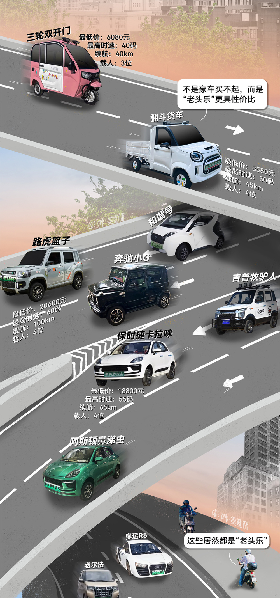
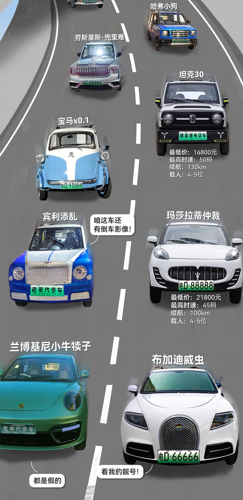
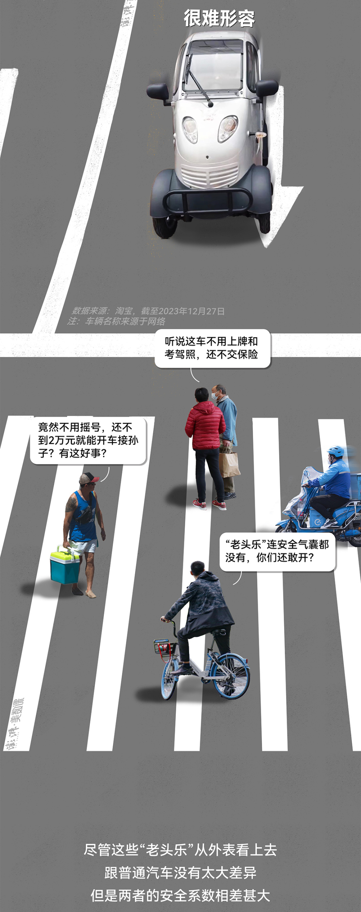
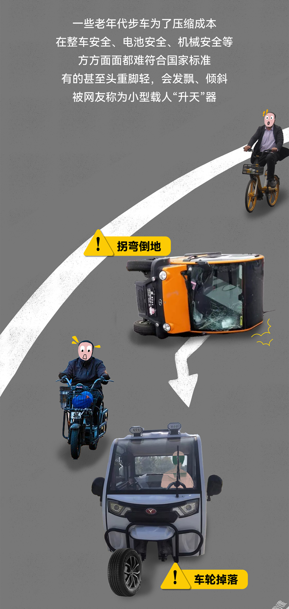
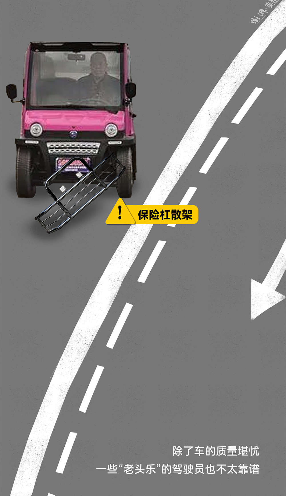
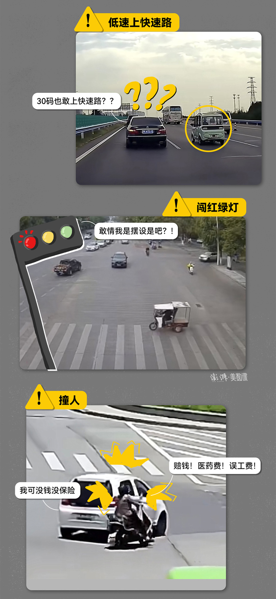
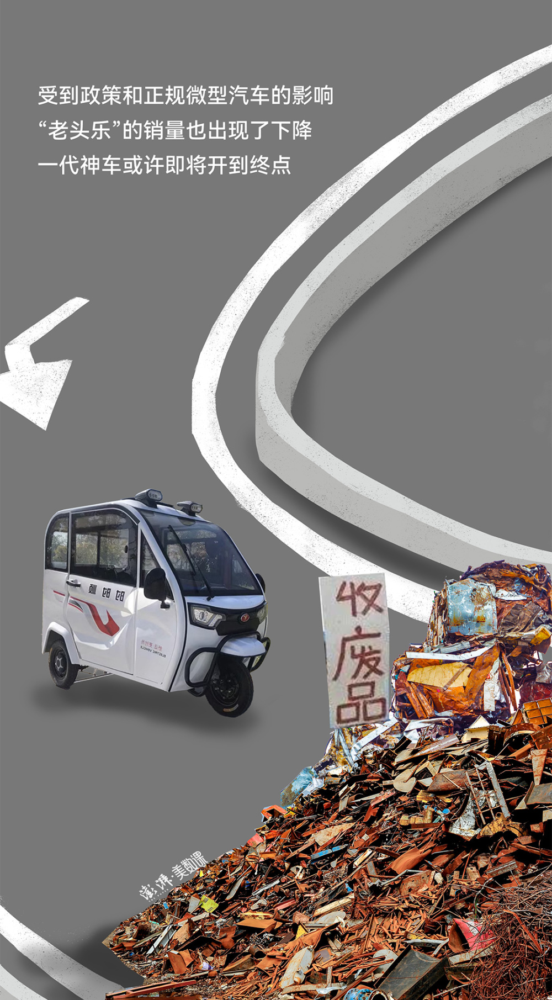

# 2024年1月1日起北京将禁止“老头乐”上路，这种车到底有多离谱

2024 年 1 月 1 日起，“老头乐”在北京将被全面禁止。

不止北京，近年来全国多个城市都在出台规定清退违规低速代步车。很多普通人对此表示欢迎：社交媒体上一项 4.6
万网友参与的“是否支持全面禁止老头乐上路”投票中，有 56.5% 的人表示支持，另外还有 30.4%
的人认为“要么禁止上路，要么严格管理（考驾照、上保险）”。

**“老头乐”退出城市会成为大势所趋，与其行车不规范所引发的交通事故紧密相关。** 2023
年上半年，北京市全市的交通死亡事故中，违规电动三、四轮车相关的占了近 10%。

但也有人对老年人未来的出行方式选择变少感到担忧——“ **老头乐”的背后，是数以万计老年群体的出行需求——带娃、买菜、出行。**
尤其是农村地区缺乏出行便捷、价格低廉的公共交通方式，“老头乐”完全停止销售，可能会降低老年人的出行自由度。

因此，随着“老头乐”逐渐被禁，由此产生的老年人出行需求供应空白，也要交通管理者和市场共同填补。
**提供更加“适老化”的安全出行方式，是最治本的解决方法。**

