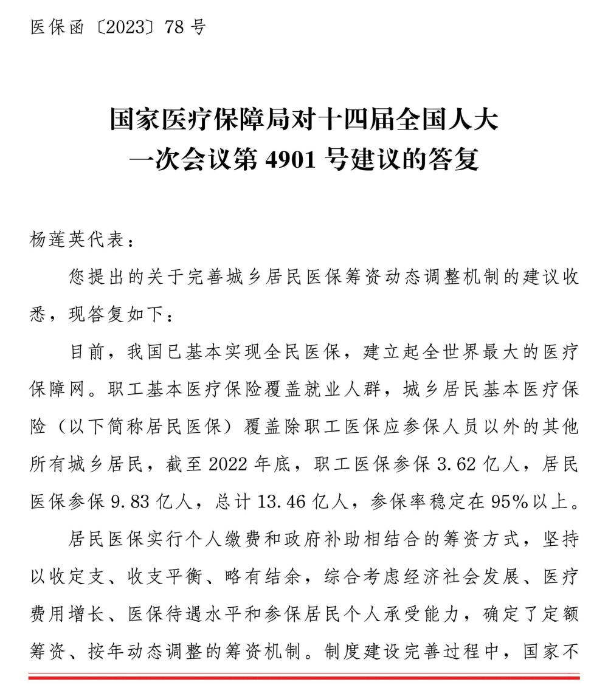
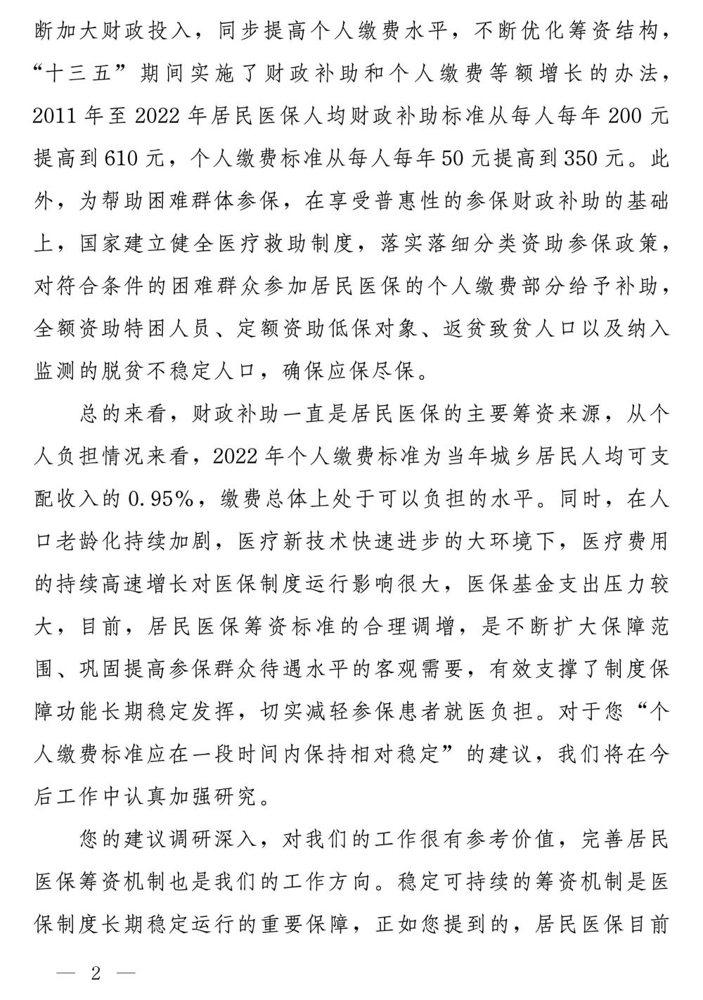
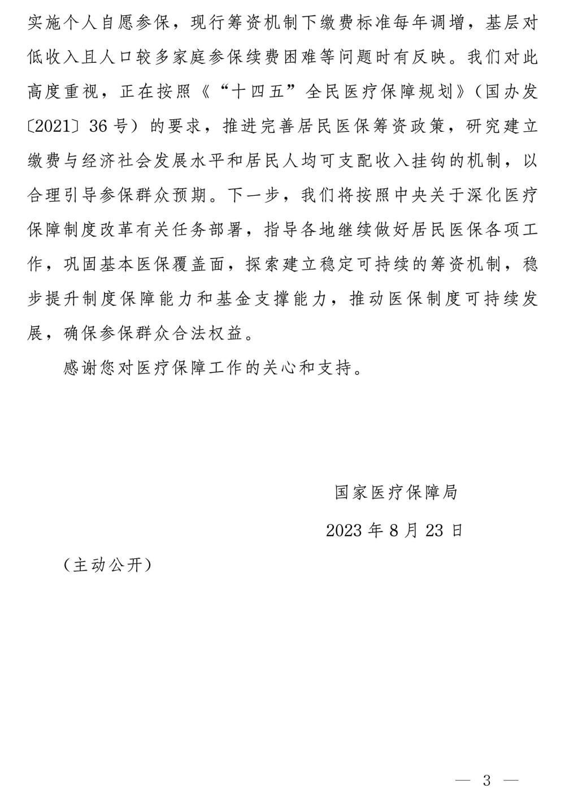

# 国家医保局：推进完善居民医保筹资政策

据国家医保局网站12月27日消息，国家医保局8月23日答复十四届全国人大一次会议第4901号建议时表示，该局正在按照《“十四五”全民医疗保障规划》的要求，推进完善居民医保筹资政策，研究建立缴费与经济社会发展水平和居民人均可支配收入挂钩的机制，以合理引导参保群众预期。下一步，国家医疗保障局将按照中央关于深化医疗保障制度改革有关任务部署，指导各地继续做好居民医保各项工作，巩固基本医保覆盖面，探索建立稳定可持续的筹资机制，稳步提升制度保障能力和基金支撑能力，推动医保制度可持续发展，确保参保群众合法权益。

