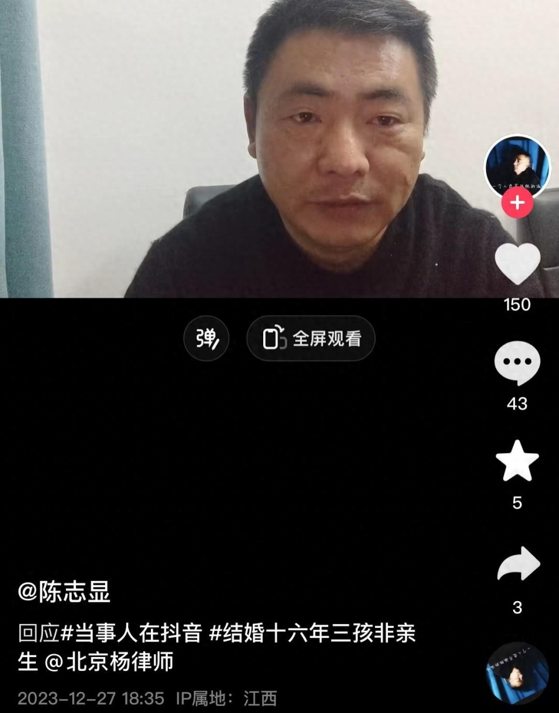
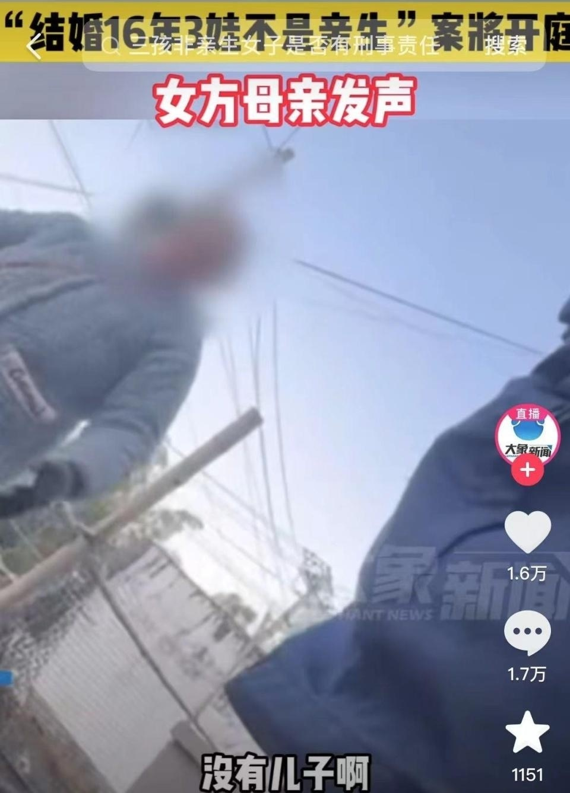

# “结婚16年3娃非亲生”男子回应女方母亲，否认家暴和重男轻女：连骂都舍不得骂她，如果想生男孩有很多方法

12月27日下午，在江西，“结婚16年3娃非亲生”当事人陈先生最新发声，否认女方母亲所说的家暴和重男轻女。

视频中，陈先生称妻子没结婚前已经怀孕，他曝出3个孩子的具体出生日期，称和妻子领证结婚到发现对方出轨前，自己从未对她动过手，甚至连骂都舍不得骂她。

陈先生还表示自己16年来所有的收入都交给妻子保管，不可能去打她。

关于重男轻女，陈先生否认称：“如果想生男孩，相信很多人都知道有很多方法。”

此前，大象新闻采访到女方俞某的母亲，她称男方家里嫌弃自己女儿没生儿子，引发热议。“在他们家（婆家）受气，三个孩子都是我一手带大的，好像是因为我女儿没有生儿子，就把我女儿赶出来。”

**此前报道 >>**

据九派新闻视频报道，“结婚16年3娃非亲生”案明日开庭。2022年3月，在江西，长期在外地工作的陈先生发现妻子和另一男子同住宾馆，他对3个孩子进行DNA鉴定，结果都非亲生。

陈先生透露手机里仍保存着3个女儿的照片和一家人出游视频，小女儿骑在他肩上玩雪开心大笑。

谈到妻子，陈先生称：“不是她有多漂亮才会出轨，人的道德三观，才会这样。”

事发一年多，陈先生坚持先追责再离婚，他在网上开直播专门曝光此事。

12月27日，女方这边有亲属发声做出回应。

据大象新闻消息，结婚16年3娃非亲生”案开庭在即，女方母亲发声称女儿没有回来，她要在外边打工养3个孩子，一个月工资就3000元。

女方母亲还表示女儿头年嫁过去，第二年11月生了孩子就回来了。“他家讲我女儿生女儿啊，没有儿子啊，把她赶出来了，他用脚踢我女儿下身，要给我女儿打死。要不是我村里人看到，她都要死掉了。”

**【来源：综合当事人账号、九派新闻视频、大象新闻等】**

**声明：此文版权归原作者所有，若有来源错误或者侵犯您的合法权益，您可通过邮箱与我们取得联系，我们将及时进行处理。邮箱地址：jpbl@jp.jiupainews.com**

