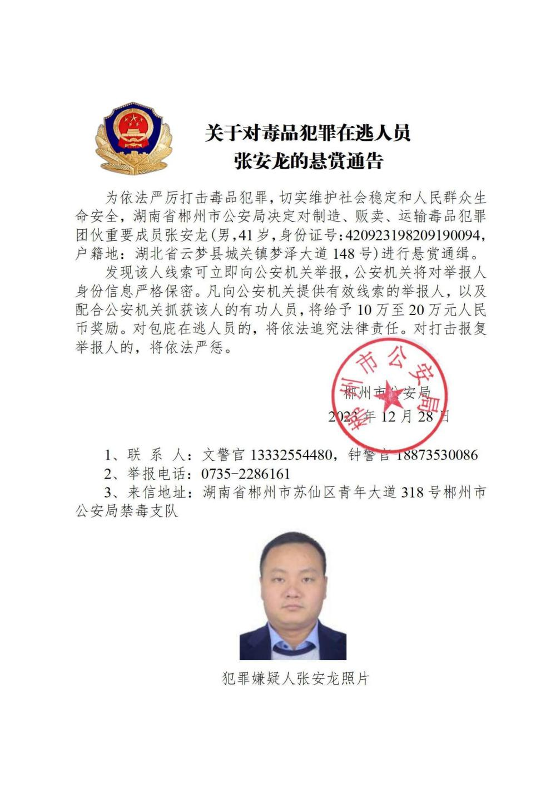
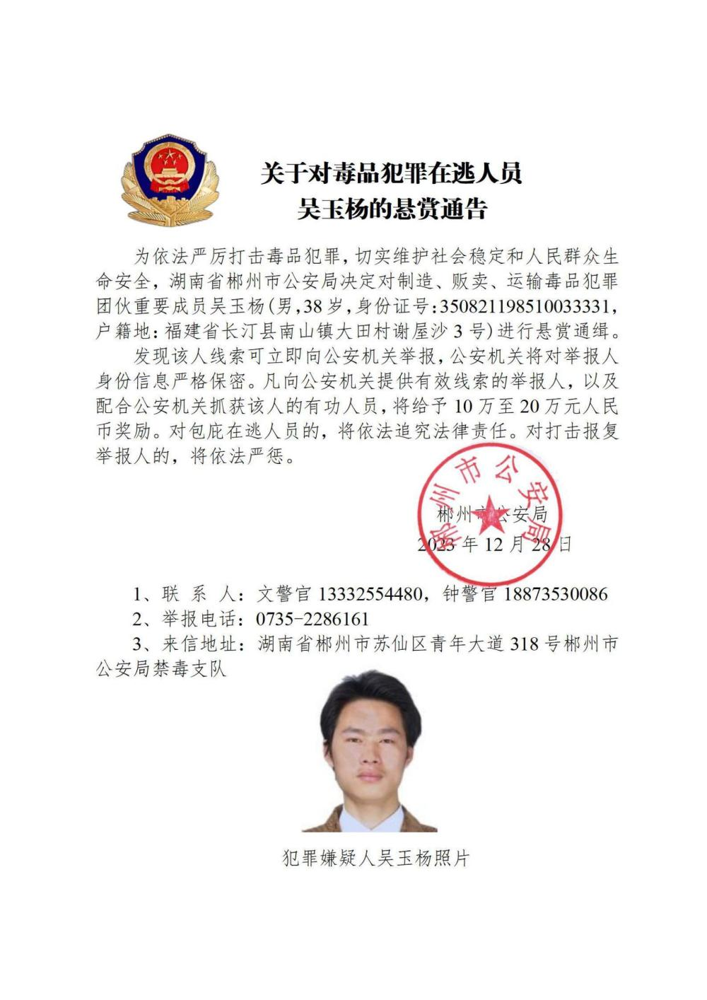
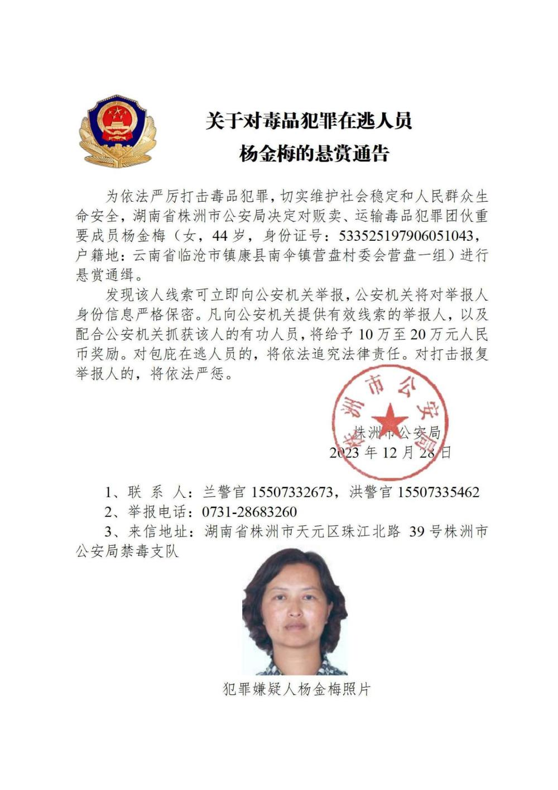
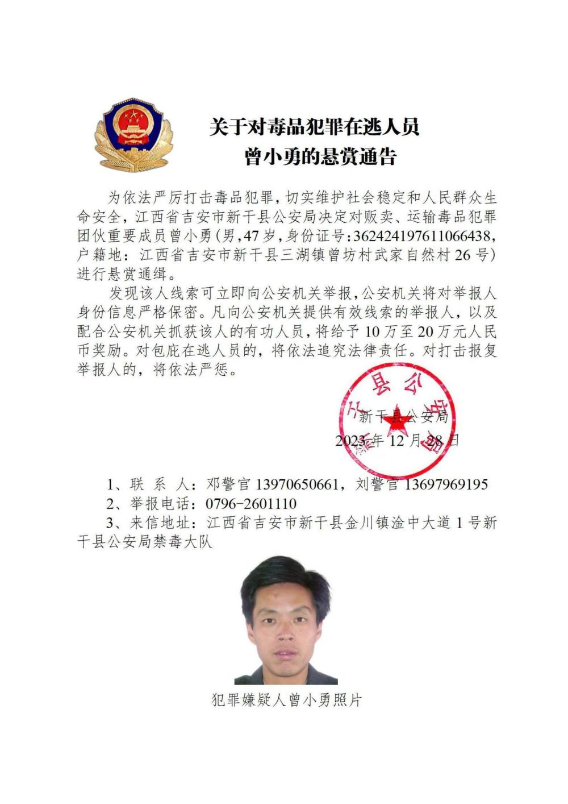
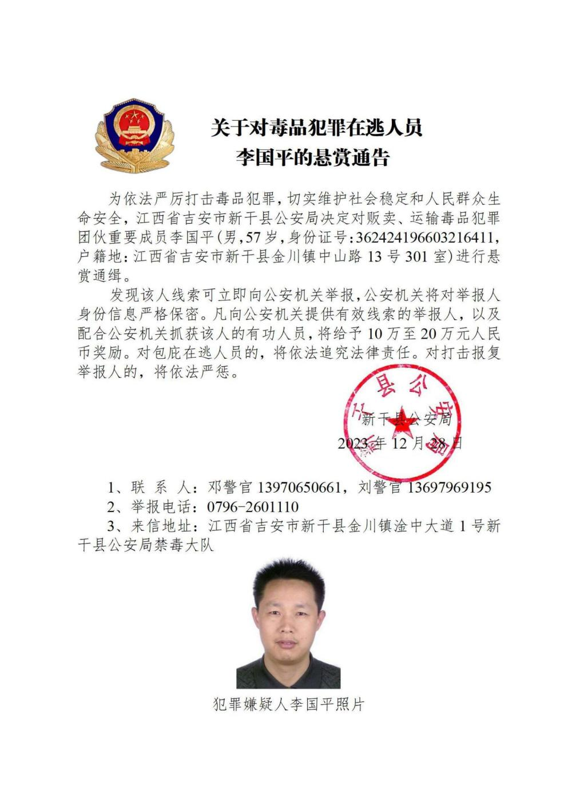
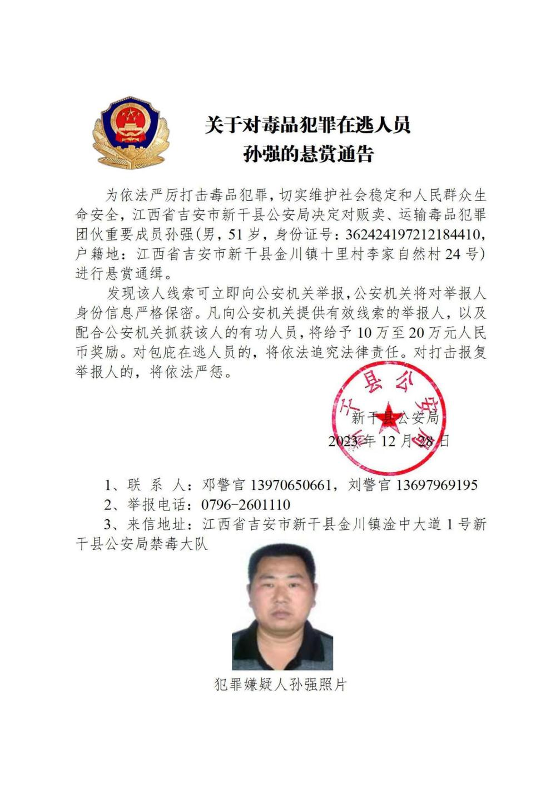
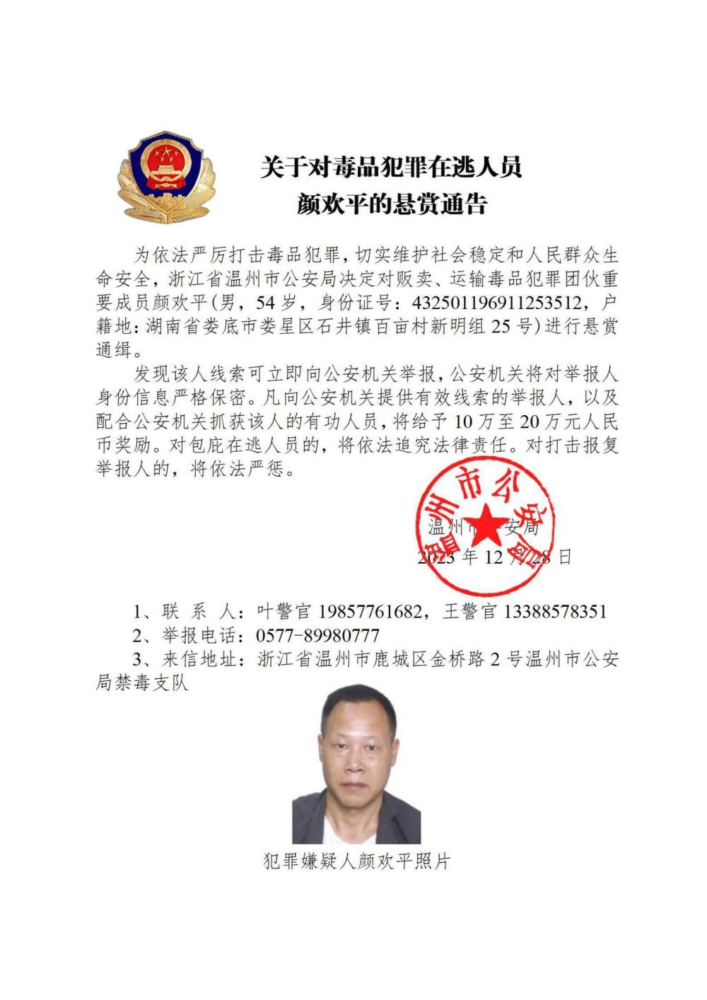
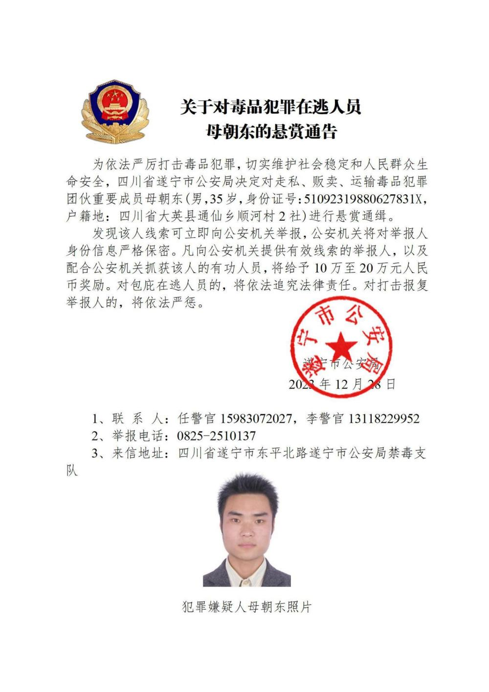
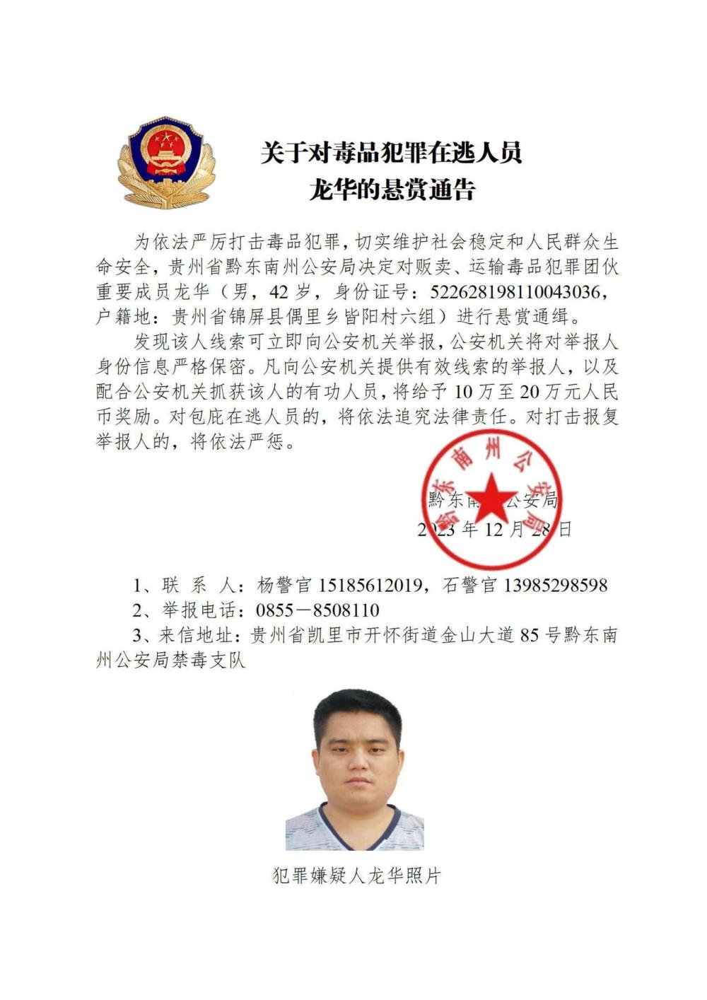

# 公安机关公开通缉10名缅北地区重大涉毒逃犯

记者12月28日从公安部获悉，为进一步依法严厉打击缅北地区毒品犯罪，全力遏制境外毒品向我渗透内流，切实维护人民群众生命健康和财产安全，各地公安机关在充分掌握相关犯罪事实和证据的基础上，决定对张安龙、曾小勇等10名藏匿在缅北地区涉毒逃犯进行公开悬赏通缉，力争早日缉拿归案，坚决铲除长期危害我社会稳定的境外“毒瘤”。

其中，湖南省郴州市公安局决定对张安龙、马文祥、吴玉杨进行公开悬赏通缉；湖南省株洲市公安局决定对杨金梅进行公开悬赏通缉；江西省新干县公安局决定对曾小勇、李国平、孙强进行公开悬赏通缉；浙江省温州市公安局决定对颜欢平进行公开悬赏通缉；四川省遂宁市公安局决定对母朝东进行公开悬赏通缉；贵州省黔东南州公安局决定对龙华进行公开悬赏通缉。

公安机关敦促张安龙、曾小勇等犯罪嫌疑人认清形势，主动投案自首，争取宽大处理。同时，希望社会各界和广大人民群众积极举报，协助抓捕犯罪嫌疑人。对提供有效线索和协助抓捕的有功人员，公安机关将给予10万元至20万元人民币奖励。

近年来，按照国家禁毒委、公安部“清源断流”行动战略部署，各地公安机关通过开展国际执法合作，对潜藏在境外向我境内大肆走私贩卖毒品逃犯开展追捕行动，累计抓获涉毒逃犯300余名，对境外贩毒团伙形成了有力震慑。（记者熊丰）

