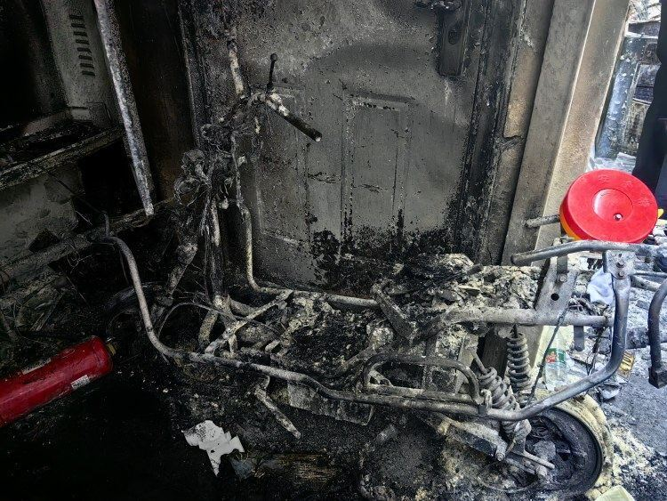
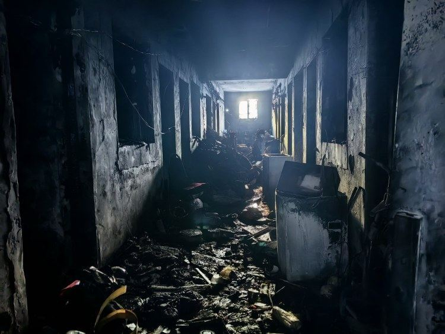
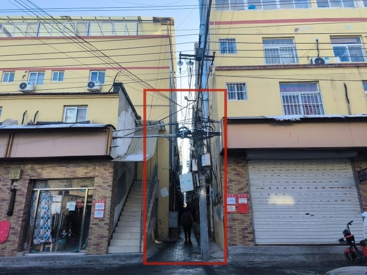
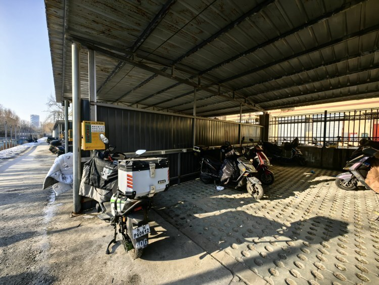
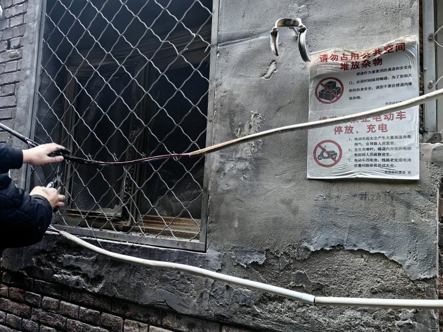
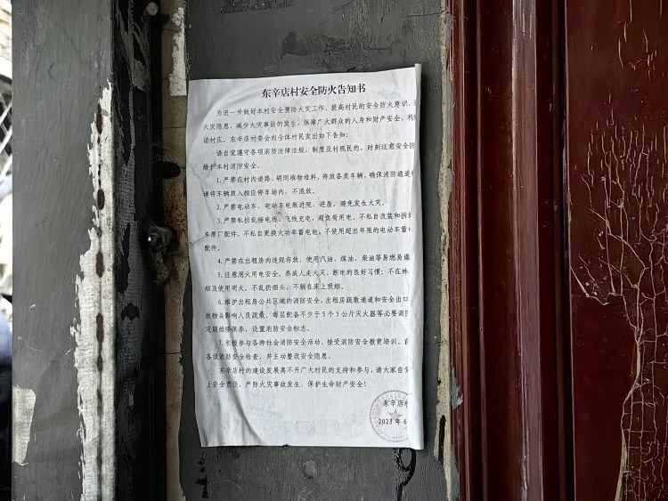
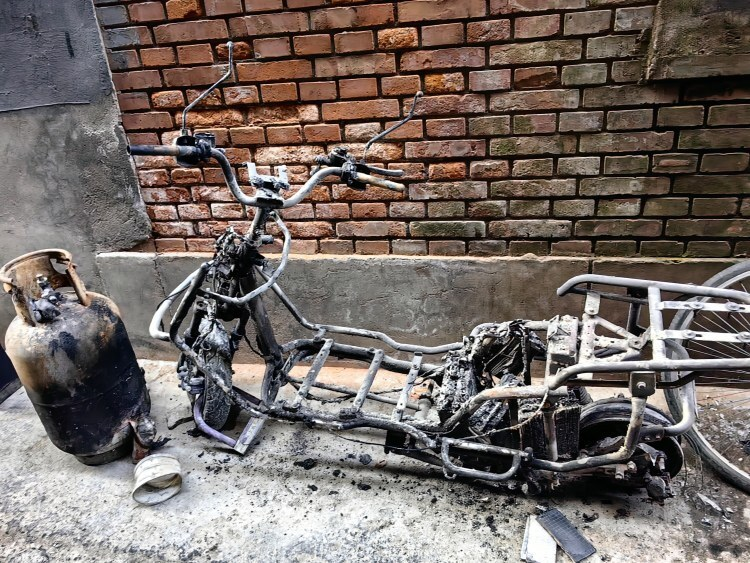

# 北京4死5伤火灾现场：电动自行车烧得只剩车架，楼道内有禁止充电提示

12月28日6时许，北京朝阳消防通报称，当天3时17分，北京市119指挥中心接警，位于朝阳区崔各庄乡东辛店村某村民自建房1层发生火情，随即调派3个消防站9辆消防车到场处置。

3时43分现场火灭，现场疏散54人，营救出9名被困人员均已送医。其中，4人已无生命体征，5人正在全力救治中。

经初步调查，火灾原因系电动自行车起火所致。

 _一辆电动自行车在火灾中被烧得只剩下架子。摄影/上游新闻记者 沈度_

12月28日上午，上游新闻记者现场看到，在4层自建房的一层门口，一辆疑似引起火灾的电动自行车被烧得只剩车架，现场工作人员仍在调查起火原因。一层约有10户，楼道内地面布满烧焦的杂物残骸。

_起火房屋一层楼道内一片焦黑。摄影/上游新闻记者 沈度_

两栋4层自建楼之间，是一条长约100米、宽约2米的小巷，小巷中还停有多辆电动自行车、摩托车。起火房屋正对面一户人家的电路损坏，现场有电工在维修电路。

上游新闻记者看到，起火的房屋门口和正对面的墙壁上，都贴有安全提示信息，“严禁电动车（电瓶）进入室内”“楼道内禁止电动车停放、充电”。

_火灾发生地位于狭长小巷中的一层，从进口进去约50米的建筑起火。摄影/上游新闻记者 沈度_

住在起火楼栋隔壁的一位一层住户说，火灾发生时他被一阵响声吵醒，推测是起火电动车发出的声音，“噼里啪啦地，就像放鞭炮一样。”

_起火房屋不远处的电动车充电站。摄影/上游新闻记者 沈度_

上游新闻记者注意到，在起火自建楼的斜对面，就是一处专供电动车充电的停车场。隔壁自建楼住户告诉记者，在停车场充电，一辆车要先缴纳每月50元的入场费，每次充电还要扫码缴费，“六七块还充不满，一个月给电动车充电就要花几百块钱。”

 _起火房屋对面，电工在维修受损电路，墙壁上可见禁止电动车充电的安全提示。摄影/上游新闻记者 沈度_

地图显示，东辛店村距离北京望京东地铁站仅有1.5公里。一位住户称，这里交通便利，每月房租算上水电1200元左右，但不带厨卫，公共厕所就在自建楼旁边，洗澡要到隔壁村的澡堂。另有住户称，其租住的房间面积9平方米左右，房租不到2000元。

 _自建楼墙壁上张贴的防火告知书。摄影/上游新闻记者 沈度_

_被烧毁的电动自行车电路板。摄影/上游新闻记者 沈度_

_另一辆被烧得只剩车架的电动自行车。摄影/上游新闻记者 沈度_

上游新闻记者 沈度

