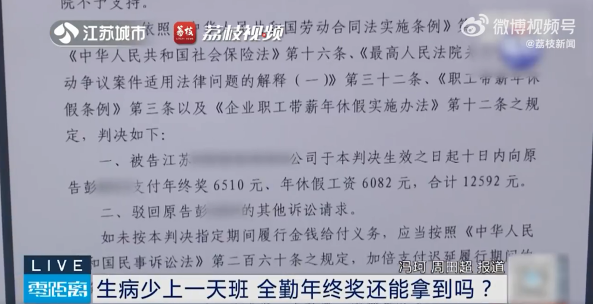
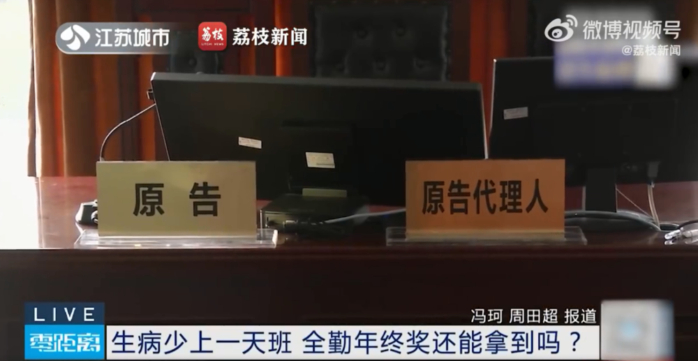
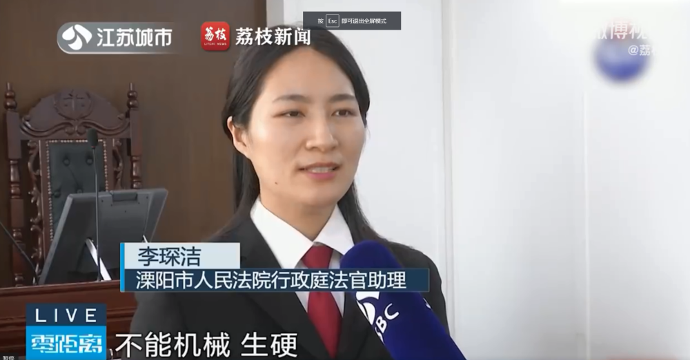

# 女子因病少上1天班没了年终奖 法院：不能生硬执行规章制度 可以领取

每经编辑：杜宇

12月28日，话题“ **因病少上1天班没了年终奖** ”冲上热搜第一，引网友关注。

据溧阳法苑官方微信号11月16日报道，在溧阳某公司上班的彭阿姨在单位从事后勤工作，2022年12月底，彭阿姨受到病毒“袭击”，经核酸检测为异常。因公司后勤人手不足，彭阿姨在身体不适的情况下依然坚持工作，但工作过程中病情并没有好转，因此彭阿姨多次和公司协商,希望公司能安排人手让自己休息几天，几次协商过后公司终究不同意，最终在12月29日，也就是全年工作日的倒数第二天，彭阿姨实在无法坚持工作，于是从公司离职。

彭阿姨离职后，认为自己为公司工作了十几年，没有功劳也有苦劳，公司的做法让她寒心，于是便通过向法院诉讼的方式提出要求支付工资、补偿金以及年终奖的请求，公司在庭审中回复道：规章制度明文规定，只有上满全年，才能在第二年的1月领取上一年年终奖，彭阿姨在12月29日离职，还差一天才算全年全勤，不符合支付年终奖的条件，所以不愿意支付年终奖。

该案经溧阳法院审理后认为，
**彭阿姨一直工作至该年12月29日，因感染新冠病毒需休养才引发后续离职事宜，故尽管原告还需再工作一天才算年满，但综合考虑员工感染新冠病毒期间公司应安排必要的病休假等因素，认定彭阿姨该年工作满一年，可以领取该年度的年终奖。**

**该消息引发网友热议：**

法官提醒，
**用人单位应当在安排劳动者参加工作、服从管理的同时，应重视员工的身体和心理健康，尊重员工劳动过程中依法享有的休息休假权利，不能机械生硬不加变通地执行规章制度，若缺乏对劳动者权益最基础的保障，将承担违反法律规定的不利后果。**

每日经济新闻综合溧阳法苑官方微信号、荔枝新闻、新浪微博网友评论

每日经济新闻

