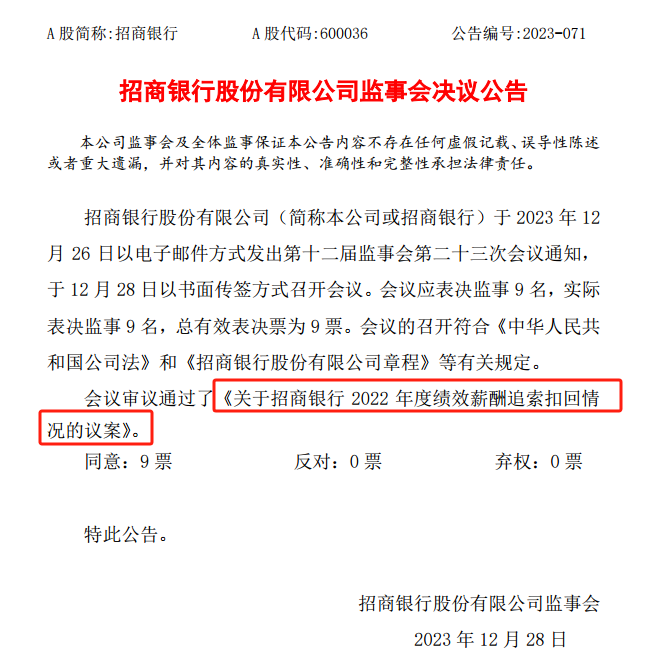
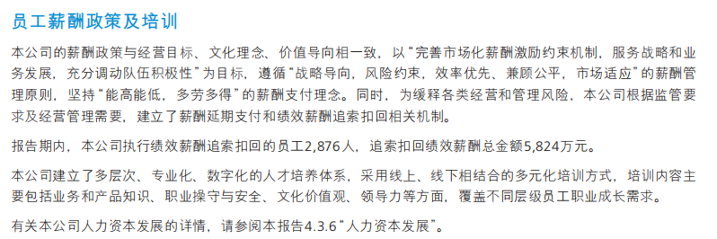
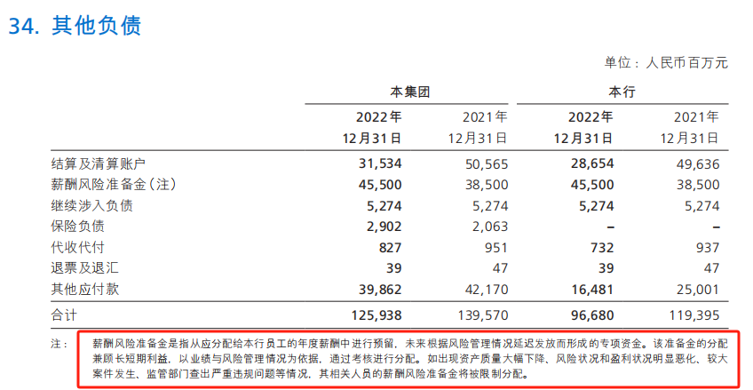

# 招行审议通过“2022年度绩效薪酬追索扣回”议案，人均被退薪超2万元

金融界12月28日消息 今日招商银行发布监事会决议公告，公告显示，会议审议通过了《关于招商银行2022年度绩效薪酬追索扣回情况的议案》。

据相关报道，招商银行2022年报中披露，为缓释各类经营和管理风险，招商银行根据监管要求及经营管理需要，建立了薪酬延期支付和绩效薪酬追索扣回相关机制。报告期内，招商银行执行绩效薪酬追索扣回的员工2876人，追索扣回绩效薪酬总金额5824万元。相当于人均被退薪2.03万元。

同时，招商银行从应分配给该行员工的年度薪酬中预留了薪酬风险准备金，如出现资产质量大幅下降、风险状况和盈利状况明显恶化、较大案件发生、监管部门查出严重违规问题等情况，其相关人员的薪酬风险准备金将被限制分配。

